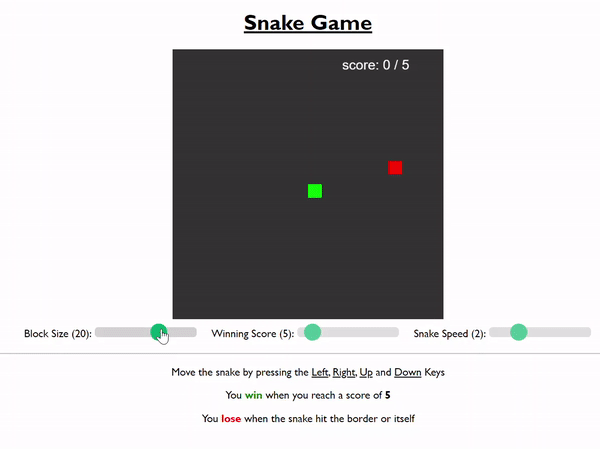

# Snake Game

[Live website](https://ztjhz.github.io/snake-game/)

---
##### Instructions

- Move the snake by pressing the UP, DOWN, LEFT or RIGHT keys

- Win when score reaches the winning score

- Lose when snake hits the border or itself.

---

##### Functions

- Able to dynamically update the win score

- Change the winning score with a slider

- Change the speed of the snake with a slider

- Change the size of the snake with a slider
